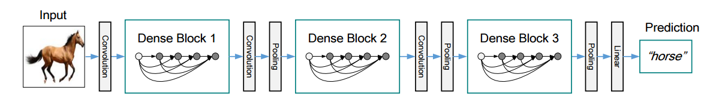

Keras implementation of DenseNet, which is described [here](https://arxiv.org/pdf/1608.06993v3.pdf).

Those unfamiliar with densenets may find this image from that paper useful.  

The model is composed of `Dense Blocks`  Each dense block is composed of multiple `composite layers`.  A simple composite layer is a BatchNormalization->relu->convolution block. A complex composite layer (used in DenseNet-BC) includes an extra 1x1 convolution->relu->BatchNormalization.

Each composite layer in a dense block has direct connections into all subsequent composite layers in that dense block (using skip connections reminiscent of ResNets).  

Changes in receptive field happen in the transition layers between the dense blocks.  In case you are interested in more detail, I found the paper very well written.
